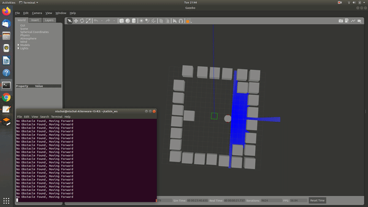
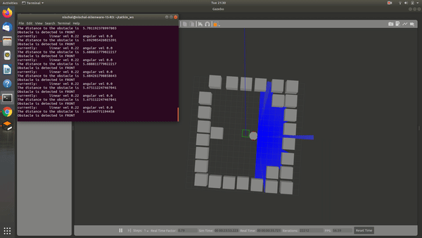

# Obstacle-Avoidance-Custom-Robot

## Overview
This ROS package gives a URDF custom robot the ability to move while avoiding obstacles in its path.The simulation is done in gazebo with a custom made fully enclosed world. There is also an option to control the Robot using keyboard input and the sensor data is shown on the terminal.

## Visualization of the Project
### Autonomous Navigation on ROS and Gazebo

  
### Tele-Op Navigation on ROS and Gazebo with a keyboard


## Youtube Links for the videos

* https://www.youtube.com/watch?v=v5FFh2v3XLY
* https://www.youtube.com/watch?v=c1M12yejnbY

## Dependencies

The following are the dependencies to run the package:

* ROS distro :Melodic
* Ubuntu 18.04
* Gazebo

## Installing ROS Melodic and Dependencies

Run the below command to install the package for turtlebot_gazebo

```
sudo apt install ros-melodic-desktop-full
sudo apt update 
sudo apt install -y python3 python3-dev python3-pip build-essential 
sudo -H pip3 install rosdep rospkg rosinstall_generator rosinstall wstool vcstools catkin_tools catkin_pkg
```

## Steps for building package

* Install catkin
```
sudo apt-get install ros-melodic-catkin
```
* Setup Catkin Workspace
```
mkdir path_to_catkin_workspace
cd path_to_catkin_workspace
mkdir src
cd src
```
* Clone the package repository
```
cd path_to_catkin_workspace/src
git clone --recursive https://github.com/NJNischal/Obstacle-Avoidance-Custom-Robot
```
* Build package and install using catkin
```
cd path_to_catkin_workspace
catkin_make
source ./devel/setup.bash
```
* Running the Gazebo Simulation using launch file
```
roslaunch Obstacle-Avoidance-Custom-Robot project.launch 
```
* Running the Tele Operation with sensor feedback
```
rosrun Obstacle-Avoidance-Custom-Robot manual_control_with_sensor_reading.py 
```
* Running the package using launch file with recording in rosbag off
```
rosrun Obstacle-Avoidance-Custom-Robot autonomous_navigation.py 
```
## View the Custom world for the gazebo simulation:
```
roslaunch Obstacle-Avoidance-Custom-Robot World_open.launch 
```
